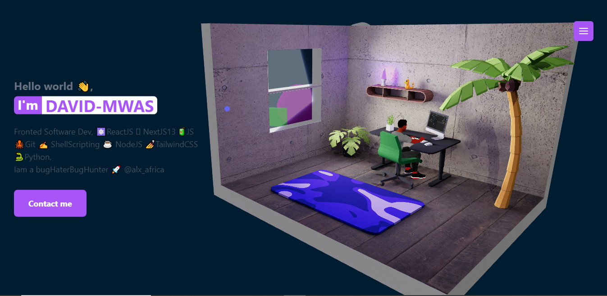

## 👋Hello wrld

## WELCOME TO DAVID-MWAS PORTFOLIO🚀

My personal portfolio is initialized with Vite + React framework

## Technologies used

<!--  +  -->

 

       
        +
        
 

Vite + React as main JS framework, React three && React three fiber for 3D rendering,💅 Tailwind CSS for styling, Baked in blender ,3D Models and Avatar made in Ready player me and its animations in Miximo, Framer motion for web animation effects and hosted on vercel.

## Live site

🏹 https://david-mwas.vercel.app/

## Github

🎯 https://github.com/David-mwas/My-3D-Portfolio.git

### Inspiration

This project was inspired by a React three &&React three fiber tuitor @WAWA SESEI🐬
